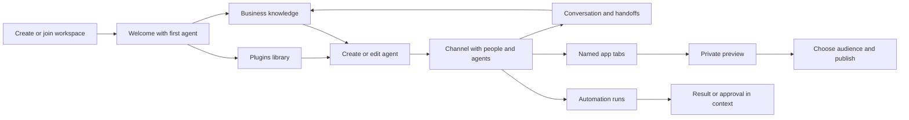

# Product flows and reference evidence

Research and design checkpoint, 24 September 2026. This document owns the flow
map requested by Gustav; `AIOS_PILOT.md` owns implementation order,
`FEATURES.md` owns capability coverage, and `STATUS.md` owns execution evidence.
This is a design contract, not a claim that the following flows already work.

## Evidence and interpretation

- **Documented** means a public primary source describes the behavior.
- **Source-observed** means an inspected code path implements it, without a
  claim that we ran the upstream product or verified its deployment.
- **Transcript-observed** means the walkthrough describes/demonstrates it in
  the available transcript. Exact visual composition remains unverified.
- **Target** means our chosen design, including Gustav's explicit corrections.
  Unknown upstream details remain unknown; we do not reproduce their private
  implementation or assume advertised capabilities are tested.

OpenAgents reference: `fd523077a000f9f17efa2ca4fa8cf7628610305d` in the read-only
research checkout. Buzz fork audit: `4067f99` plus preserved local repairs.
Kylon public docs are reviewed as retrieved on this date. Codex screenshots
inform library hierarchy; its Linux community wrapper does not supply the
proprietary Plugins UI source. Agent Native editors are bounded module
candidates, not the application shell or identity/backend system.

## The model users should understand

| Thing | What the person does with it | Where it belongs |
| --- | --- | --- |
| Workspace | Join the team and find its durable work | Host identity and workspace switcher/settings |
| Business | Read and correct what the agents should know about the company | Business in the main sidebar |
| Plugin | Add a tool integration or reusable skill package | Plugins directly below Business |
| Connection | Authorize a particular account and its supported actions | Plugin details; selected during agent setup |
| Agent | Give a role, choose tools/skills/context, choose where it runs | Agents create/edit/profile |
| Channel | Bring people and agents together around a piece of work | Channels in the main sidebar |
| App | Work with a named document or tool in that channel | Channel tab; optional pin for frequent use |
| Automation | Repeat agreed work and inspect its runs | Channel action and a workspace overview |

The primary navigation remains the Buzz sidebar. Local category switches in
Plugins and resource tabs within a channel have a narrower purpose. Business
contains no huddle, members toolbar, conversation timeline or all-product tabs.
Setup detail opens when needed, rather than becoming a second permanent rail.

## Connected target flows

Every flow must retain workspace/actor/resource scope across navigation,
retries and reconnects. UI and CLI operate on the same durable objects. A
configuration save is distinct from a runner actually applying it.

| ID | Entry and main sequence | Durable result and access | Failure / recovery acceptance |
| --- | --- | --- | --- |
| F01 Workspace and host | Create on this host or join an existing URL → identity → workspace → first agent. Operator details stay out of ordinary joining. | Host owns shared messages, context, files, app documents and history; client owns its identity/session. | Wrong host and denied invitation have recovery; reconnect reuses workspace and does not silently create another. |
| F02 Welcome | Choose/name the first ordinary agent → configure a usable runtime → Welcome → describe company → optional source connection → review saved knowledge → do useful work. | Stable Welcome, agent and business-context IDs; first agent remains available afterwards. | Resume after refresh/start failure; cancel optional connection without losing conversation; repeat setup does not create duplicate agents/rooms. |
| F03 Business knowledge | Open Business → scan company summary and sources → edit a focused detail → save → inspect attribution/history when needed. Agent proposes changes from Welcome or a working channel. | Separate context identity and grants, versioned document and provenance; conversation is not the knowledge store. | Stale writes conflict visibly without losing the draft; unsupported content is recoverable from history; agents use current authorized knowledge. |
| F04 Plugins and connections | Search Plugins → inspect supported tool → connect account → select resource scope → verify → optionally import a selected source to Business. | Account authorization stays in host secret storage; imported knowledge records source and destination. | Cancel/expired auth keeps setup recoverable; disconnect revokes future provider use but does not pretend already-imported text disappeared. |
| F05 Create/edit specialist | Agents → name, purpose and instructions → Tools & skills → select accounts/actions, skills and context → runtime/location → save/start. Missing setup returns inline to the same draft. | One agent identity, saved capability selection and applied runtime status. Library installation alone grants nothing. | Unsupported runtime/skill combination blocks start with a fix; partial setup preserves draft; revocation denies subsequent tool calls, including old queued jobs. |
| F06 Skill lifecycle | Plugins → Skills → inspect instructions/assets/source → import or create → choose version in agent setup → run → update/disable deliberately. | Library package identity/version/provenance; agent pins the selected revision. No credentials in packages. | Validation rejects traversal/oversize/invalid bundles; installation failure is not reported as installed; an update can return to a known version. |
| F07 Conversation and handoff | Open channel or DM → ask/mention → see which agent owns the turn → thread for focused work → hand off with context and expected result → stop or steer. | Signed conversation/thread/run references; channel membership and agent instruction policy remain separate. | Offline/busy agent is visible; reconnect retains history; stop, duplicate sends, multi-agent loops and conflicting edits have bounded behavior. |
| F08 Team and access | Invite teammate → join → add appropriate channels → select agent access → remove member or revoke invitation when needed. | Workspace, channel, agent-admin and resource access are explicit relationships. | Another member/outsider cannot gain access through guessed IDs, search, exported links or stale subscriptions; revocation takes effect on future delivery and calls. |
| F09 Files and retrieval | Upload from conversation or a file view → preview → attach/use in work → search by meaning/title/text where supported → open original context. | File metadata, media bytes, uploader/provenance and scoped references; knowledge snapshots are distinguishable from files. | Too-large/unsupported upload gives actionable feedback; missing media is honest; archive/restore retains references and does not widen visibility. |
| F10 Channel apps | Channel → add tab → choose Calendar/Slides/Design/Tables/Sites → name instance → edit/save → ask permitted agent to update it → reopen. | Stable app ID, parent channel, type/schema, revision and title. Multiple same-type instances; ordinary channel Canvas unchanged. | Another member sees the same result; stale writes preserve drafts; removing channel membership denies app access; legacy private app documents stay recoverable. |
| F11 Tables and views | Add Tables → fields/rows → useful saved view → import/export → let an agent read/update authorized rows → use in a generated app. | Typed data and view definitions separate from app presentation; bounded operations and schema evolution. | Invalid types/formulas/imports fail explicitly; concurrent edits and duplicate imports are controlled; CSV/export does not execute injected formulas. |
| F12 Build and preview an app | Ask in channel → agent proposes useful shape → create private draft → inspect working preview/data → request edits → review result. | Draft/version references and scoped data/tool dependencies; editing and running are distinct permissions. | Preview crash or unavailable connection leaves draft/source available; failed build preserves previous version; generated code receives no workspace signing key. |
| F13 Publish and share | From verified draft → choose channel, workspace or public audience → choose authorized publisher → publish → open share as intended recipient → update or revoke. | Deployment/version, audience policy and publisher grants; pinning a tab does not publish it. | Anonymous/private/outsider access is tested separately; revoke invalidates future access; failed deployment does not replace a working release. |
| F14 Automations and approvals | Describe repeated work → choose trigger/schedule/timezone, channel, agent and allowed tools → review → enable → see runs → approve action if required. | Definition version, trigger receipt, run/step status, approval binding and output links. | Duplicate triggers do not duplicate effects; denial/expiry stops work; missed runs and interrupted effects are visible and recover through explicit retry policy. |
| F15 Browser collaboration | Ask agent to browse → see its scoped session/tab → intervene for a human-only step → return control → keep or end session deliberately. | Session owner/scope, run references and optional retained browser state; distinct from generated-app preview. | Login/handoff never fakes completion; agent/browser stop cleans owned processes; disconnect/reconnect and concurrent control have clear states. |
| F16 Voice and calls | Start voice from a conversation, or accept/decline an agent's call request → speak → review useful transcript/context updates → end. | Call/session/request binding and optional scoped transcript; external telephone adapter is a separate capability. | No automatic answer; expired requests do nothing; denied mic, network loss and end release resources; Danish speech quality requires actual evidence. |
| F17 Remote machines and models | Register/pair runner → choose machine/runtime/model for agent → start → observe ready → work from another client → stop/reconnect. | Agent identity remains stable across runtime bodies; machine authority is explicit and separate from workspace membership. | Offline host/runner/model gives useful recovery; duplicate starts converge; revocation blocks further control; never silently fall back to a paid cloud model. |
| F18 Inbox and ongoing work | Return to workspace → see relevant replies, results and approvals → open the precise channel/thread/app → resolve → unread state follows. | Read/unread/notification state and durable result links with current access. | No notification storm for routine healthy work; expired actions and removed access resolve honestly; deep links survive client restart. |
| F19 CLI and programmatic use | Authenticate to chosen host → discover capabilities/help → inspect/create/update the same resources → emit parseable output → verify result. | Same authorization and revision rules as UI, actor-attributed changes and bounded queries. | Meaningful exit codes; no secret logging; stale revision/denial/repeated effects match UI semantics; no separate CLI-only source of truth. |
| F20 Operations and recovery | Host setup → health → upgrade/export/backup → restore to isolated replacement → clients reconnect → verify data and grants. | Recoverable DB, media, app releases, required host secrets and configuration, with documented ownership. | Bad archive/version refuses safely; restart preserves context/history/apps; restoration validates access as well as data; desktop packaging remains deferred. |
| F21 Follow-up and reminder | In a conversation, ask for one later check → confirm scheduled time and destination → return once with the result → cancel if no longer needed. | Durable callback ID and current agent/resource grants, optionally tied to a thread. | A promise in chat is not scheduling; restart and duplicate delivery are controlled; repeated monitoring needs an explicit stopping condition. |
| F22 Tasks and plans | Capture a task → choose agent, attached knowledge/files and desired outcome → plan or prioritize → Run deliberately → review result or supply requested input. | Task identity, assignee, status, supporting resources and run/thread links. Assignment alone does not launch work. | Offline agent, missing resource and denied grant preserve the task; stop does not erase results; resumed work distinguishes completed and pending effects. |

## Cross-flow rules

Agent effective access is bounded by its explicitly selected capability,
current connection/resource grant, channel/context access and runtime support.
A skill is procedural knowledge, not authorization. A channel invitation is
not permission to use every connected account. Generated apps must be
authorized as apps, not act as an unrestricted copy of their creator.

Use the existing signed-event pipeline for new shared resources and grants,
including the generic HTTP event/query bridge when a client needs HTTP. Do
not add a parallel authentication system or endpoint per product feature.
Provider OAuth callbacks/proxies and generated-app HTTP delivery are genuine
edge adapters, with explicit responsibilities and bounded operations.

Prefer visible, reversible transitions: draft → saved → applied/ready; preview
→ published; queued → running → waiting for approval → completed/failed.
Persist enough to resume without repeating completed external effects.
Show a human-readable reason and the next action at the affected surface.

## Representative acceptance journey

Use an isolated fictional studio with two human identities and two agents.
Create/join host; configure a first agent; save company context through
Welcome; import a fixture source through a connected plugin; create a specialist
with a selected skill and limited source access; invite a teammate to a
campaign channel; add two separately named app tabs; create and revise an
output together; run a scheduled task requiring one approval; preview and
publish an app for that channel; prove outsider denial; revoke one grant and
prove a subsequent call fails; restart/restore the host and reopen the same
knowledge, conversation and output. Then exercise remote runner and voice
paths separately, without claiming a physical second machine or telephone
call from a local/mock fixture.

This journey ties the flows together. Individual component tests remain
supporting evidence; a catalog of buttons does not establish the outcome.

## Reference flow evidence

### Kylon: public documentation and walkthrough

A bounded independent reading covered 25 documentation pages plus the index;
the lead separately checked the core access, app-connection, workflow and
follow-up pages and the relevant walkthrough transcript. This establishes
documented behavior, not a test of a Kylon account.

| Flows | Reference behavior and usable evidence | Limits / decision for this product |
| --- | --- | --- |
| F01, F08 | [Workspace](https://docs.kylon.io/concepts/workspace) and [authentication](https://docs.kylon.io/authentication) place resources and credentials within one workspace. [Agent access](https://docs.kylon.io/agents/access) separates agent members/admins from room membership; adding a private agent can offer an explicit grant to named room members. | Public pages inspected do not establish the full human invite/recovery UI. Keep our signed individual identities and independently test all grants. Business and Plugins are workspace surfaces, not one owning the other. |
| F02, F05, F17 | [Agents](https://docs.kylon.io/agents/overview) and [BYO](https://docs.kylon.io/agents/bring-your-own-agent): name/specialty/runtime → provider setup → ready profile; skills, memory and connections are configurable there. BYO links expire after 30 minutes and can be retried before completion. | Our combined Tools & skills selection during creation/editing is explicit user direction. Do not copy a permanent hosted/BYO choice into Buzz unless an actual runtime constraint requires it. |
| F03, F09 | [Memory](https://docs.kylon.io/concepts/memory) separates durable agent memory, shared knowledge and room conversation; [workspace CLI](https://docs.kylon.io/cli/workspace) exposes files/search. | Public docs do not prove file-level ACL/indexing/recovery details. Our source attribution, conflict handling and context grants need their own contract and proof. |
| F04, F05, F06 | [Connections](https://docs.kylon.io/concepts/connections), [Tools API](https://docs.kylon.io/proxy/tools-api) and [proxy auth](https://docs.kylon.io/proxy/authentication): discover toolkit → authorize → link connection → invoke under the agent's access. Some provider routes also require a skill/capability. | Reviewed docs do not establish a shared Plugins catalog or full revoke/update flow. Our instruction skills and security grants have different owners, even when one package declares both. |
| F07, F18 | [Rooms](https://docs.kylon.io/concepts/rooms) documents scoped conversation/threads and a main-agent activation model; [timeline](https://docs.kylon.io/concepts/timeline) is a cross-room notification feed. | The walkthrough also describes best-agent routing. Treat this as version/context variation. Keep Buzz mentions and an explicit responsible agent rather than blindly activating every agent in the channel. |
| F11, F12 | [Tables](https://docs.kylon.io/concepts/tables) and [database apps](https://docs.kylon.io/concepts/database-apps): structured fields/rows/views → inspect upgrade plan → promote → operate typed data app. CLI docs additionally describe a transition from legacy tables toward Database Apps. | Reproduce the user outcome, not an upstream migration already underway. Our channel app resource contract supports Tables from the start; typed tables alone do not implement a hosted app. |
| F12, F13 | [App Connection API](https://docs.kylon.io/proxy/app-connections) puts provider calls in app server code. Visitor visibility/auth and the source agent's linked connections are both checked; provider secrets are withheld and widening app visibility can widen data exposure. | A static Publisher cannot substitute for this layer. Use scoped app principals, reviewed outputs and separate preview/public origins in our implementation. |
| F14, F21 | [Workflows](https://docs.kylon.io/concepts/workflows): recurring/manual/row/webhook triggers and durable runs. [Follow-ups](https://docs.kylon.io/concepts/followups): one callback, scheduled only once a durable ID exists; monitoring needs explicit rescheduling/stop. | Docs do not prove exactly-once external effects or human-approval recovery. Reuse and test Buzz's durable approval/trace behavior, including interrupted effects. |
| F17, F19, F20 | [Gateway](https://docs.kylon.io/cli/gateway), [gateway run](https://docs.kylon.io/cli/gateway-run), [agent commands](https://docs.kylon.io/cli/agent) and [troubleshooting](https://docs.kylon.io/cli/troubleshooting) cover saved computer connections, service state, provider prerequisites and reconnect/move. | Bringing a computer is not evidence that the Kylon service is self-hostable. Our host, browser-client, backup and recovery responsibilities remain independent. |

The walkthrough supplements the docs: [1:21–1:34](https://www.youtube.com/watch?v=ONd2UNBmQ40&t=4890s)
shows Welcome and context-building; [2:00](https://www.youtube.com/watch?v=ONd2UNBmQ40&t=7200s)
discusses persona/skills/connections; [2:12](https://www.youtube.com/watch?v=ONd2UNBmQ40&t=7925s)
includes an incoming phone interview; [3:01–3:11](https://www.youtube.com/watch?v=ONd2UNBmQ40&t=10860s)
describes app preview, revision, pinning, audience selection and publishing.
The public documentation index did not provide a complete browser-handoff or
phone API flow. We retain those capabilities as goals with explicit adapters
and proof, without inventing the private implementation.

### OpenAgents: pinned source

An independent read-only source pass traced UI, API, daemon and storage paths;
the lead separately checked representative task, skill, knowledge, invitation,
routine, browser, share and node operations. The links below are pinned to the
inspected revision. None of these observations is a live upstream test.

| Flows | Source-observed sequence and durable state | Reuse / difference |
| --- | --- | --- |
| F01, F02 | [Workspace creation](https://github.com/openagents-org/openagents/blob/fd523077a000f9f17efa2ca4fa8cf7628610305d/workspace/backend/app/routers/workspaces.py#L204) saves a workspace and optional first channel; configured Yumi provisioning can seed Welcome but is best-effort. [Rail](https://github.com/openagents-org/openagents/blob/fd523077a000f9f17efa2ca4fa8cf7628610305d/workspace/frontend/components/layout/nav-rail.tsx#L202) still prompts for an ordinary first agent. | Use one ordinary agent as requested; don't require a special cloud onboarding bot. Persist setup progress separately from whether a model successfully starts. |
| F08 | [Invite acceptance](https://github.com/openagents-org/openagents/blob/fd523077a000f9f17efa2ca4fa8cf7628610305d/workspace/backend/app/routers/invites.py#L94) checks identity, email binding and invite state; open links remain until expiry/revocation. Membership preserves a higher existing role. | Good recovery distinctions. Keep Buzz's signed identities; don't import OpenAgents' token/auth system. |
| F05, F17 | [Agent form](https://github.com/openagents-org/openagents/blob/fd523077a000f9f17efa2ca4fa8cf7628610305d/workspace/frontend/components/agents/agent-setup.tsx#L634) selects runtime/name/path/model/access. [Node commands](https://github.com/openagents-org/openagents/blob/fd523077a000f9f17efa2ca4fa8cf7628610305d/workspace/backend/app/routers/nodes.py#L357) require admin and enqueue create/configure for the device daemon. | Configuration, queued work and ready agent are distinct states. No general business-account selector was established in the inspected creation form. |
| F17 | [Pairing](https://github.com/openagents-org/openagents/blob/fd523077a000f9f17efa2ca4fa8cf7628610305d/workspace/backend/app/routers/nodes.py#L169) redeems a short-lived code into a node token. [Launcher](https://github.com/openagents-org/openagents/blob/fd523077a000f9f17efa2ca4fa8cf7628610305d/packages/launcher/src/main/node-pairing.ts#L116) retains multiple workspace pairings; heartbeats deliver commands. | Node deletion can be undone by a still-running daemon re-registering. Our revoke flow must invalidate the authorization, not merely hide the device row. |
| F06 | [Skills view](https://github.com/openagents-org/openagents/blob/fd523077a000f9f17efa2ca4fa8cf7628610305d/workspace/frontend/components/skills/skills-view.tsx#L286) selects a skill and online agent; [install](https://github.com/openagents-org/openagents/blob/fd523077a000f9f17efa2ca4fa8cf7628610305d/workspace/backend/app/routers/workspaces.py#L942) queues control events and waits for runner status. Custom packages reference workspace uploads. | Keep requested/applied/failed status. Our library and agent form share the package catalog. OA module/tool filtering is not evidence of per-account SaaS grants. |
| F03, F09 | [Knowledge](https://github.com/openagents-org/openagents/blob/fd523077a000f9f17efa2ca4fa8cf7628610305d/workspace/backend/app/routers/knowledge.py#L108) stores bounded Markdown blobs plus workspace metadata; UI exposes a reusable knowledge mention. Tasks can attach entry IDs. | Adopt explicit references and independent knowledge page. Our context may already be private; don't make it workspace-public just to match upstream. |
| F07 | [New thread](https://github.com/openagents-org/openagents/blob/fd523077a000f9f17efa2ca4fa8cf7628610305d/workspace/frontend/components/threads/new-thread-dialog.tsx#L44) picks online agents and optionally resumes a populated thread. [Chat send](https://github.com/openagents-org/openagents/blob/fd523077a000f9f17efa2ca4fa8cf7628610305d/workspace/frontend/components/chat/chat-view.tsx#L452) removes failed optimistic messages and restores an unchanged draft. | Keep Buzz channel/thread history and bounded handoff semantics. A resume pointer does not itself transfer every permission. |
| F14, F22 | [Task creation](https://github.com/openagents-org/openagents/blob/fd523077a000f9f17efa2ca4fa8cf7628610305d/workspace/backend/app/routers/tasks.py#L369) saves assignment without running; [Run](https://github.com/openagents-org/openagents/blob/fd523077a000f9f17efa2ca4fa8cf7628610305d/workspace/backend/app/routers/tasks.py#L555) creates/reuses a task channel and posts kickoff. [Human workflow steps](https://github.com/openagents-org/openagents/blob/fd523077a000f9f17efa2ca4fa8cf7628610305d/workspace/backend/app/services/workflow.py#L345) wait for a human message. | Adopt plan/run distinction; retain Buzz's bound approval records instead of treating any human reply as authorization for a consequential action. |
| F14, F21 | [Routines](https://github.com/openagents-org/openagents/blob/fd523077a000f9f17efa2ca4fa8cf7628610305d/workspace/backend/app/routers/routines.py#L256) validates agent/schedule and uses a dedicated agent channel. [Scheduler](https://github.com/openagents-org/openagents/blob/fd523077a000f9f17efa2ca4fa8cf7628610305d/workspace/backend/app/main.py#L185) claims due work and avoids ordinary overlap. | Our channel owns work context and results; avoid exposing hidden queue channels as navigation. Test retry/duplicate effects independently. |
| F04 | [Integrations](https://github.com/openagents-org/openagents/blob/fd523077a000f9f17efa2ca4fa8cf7628610305d/workspace/backend/app/routers/integrations.py#L133) is admin-managed Slack/Telegram/Lark bridging: credentials/webhook → external conversation mapped to channel → reply bridge; revocation disables the binding. | This is useful transport integration, not the complete business-data connection layer requested. Keep it a separately declared plugin capability. |
| F09 | [Files](https://github.com/openagents-org/openagents/blob/fd523077a000f9f17efa2ca4fa8cf7628610305d/workspace/backend/app/routers/files.py#L983) supports grouped trash and restore with collision renaming. Metadata and local/S3 blobs have separate lifecycle. | Test both bytes and metadata on recovery. Do not copy purge behavior that can remove metadata despite blob deletion failure without a recovery decision. |
| F15 | [Browser](https://github.com/openagents-org/openagents/blob/fd523077a000f9f17efa2ca4fa8cf7628610305d/workspace/backend/app/routers/browser.py#L273) reconnects or replaces sessions; named persistent contexts retain cookies. [Sharing](https://github.com/openagents-org/openagents/blob/fd523077a000f9f17efa2ca4fa8cf7628610305d/workspace/backend/app/routers/browser.py#L1028) associates agents; prompt guidance offers a live URL for human interaction. | No dedicated control-transfer protocol was established. Our current isolated Playwright MCP is not this shared human-visible browser. |
| F13 | [Shares](https://github.com/openagents-org/openagents/blob/fd523077a000f9f17efa2ca4fa8cf7628610305d/workspace/backend/app/routers/shares.py#L69) creates a point-in-time chat snapshot; active token links are public and deletion stops public retrieval. | Conversation snapshot sharing and a local tunnel do not prove app build/deploy/data authorization. Keep these distinct from our app publishing flow. |
| F19, F20 | [Self-hosting](https://github.com/openagents-org/openagents/blob/fd523077a000f9f17efa2ca4fa8cf7628610305d/workspace/README.md#L43) uses Postgres/backend/frontend; [storage](https://github.com/openagents-org/openagents/blob/fd523077a000f9f17efa2ca4fa8cf7628610305d/workspace/backend/app/storage.py#L115) selects local files or S3. Devices retain runtime state/pairing tokens separately. | No product backup/restore flow was established. Preserve our verified operations work and extend it to new shared resources. |

OA's broad workspace-token authorization and endpoint-specific role floors
are implementation facts, not a security pattern to transplant. Some module
switches filter the connector's advertised tools; that alone is not proof of
server authorization for direct calls. Shared files, tasks, skills and browser
are shell-level surfaces in this reference, whereas channel app tabs are our
deliberate product direction. Phone support and a full generated-app lifecycle
were not established by this source pass; illustrative onboarding artwork is
not evidence of those capabilities.

Plan review resolved: Plugins is a workspace-owned catalog; bundled skill
selection does not assert runtime discovery or application. New resource grants
explicitly supersede the upstream channel-only rule; current data retains its
existing ACL during the navigation slice.
